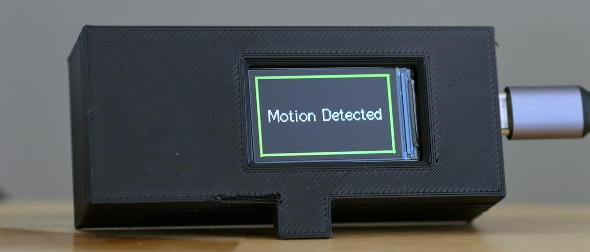

# Motion Sensor for LG OLED TV

I built a device to automatically turn on/off my LG OLED TV screen with a presence sensor. I use this TV as a computer montior, so this helps protect the OLED against burn in when I'm away from the display.

You can see a demonstration of the solution on YouTube: [My Anti Burn-In Prototype for my OLED TV Monitor](https://youtu.be/76wAEJOdBq8)

My implementation includes the following components:
- LilyGo TTGO T-Display ESP32 Controller
- LD2410C Presence Sensor
- Home Assistant Server (to send commands to my LG OLED TV) 

## Wiring
ESP32  |  LD2410C   
5V      <-> VCC  
GND     <-> GND  
13 (Configurable)     <-> OUT  

